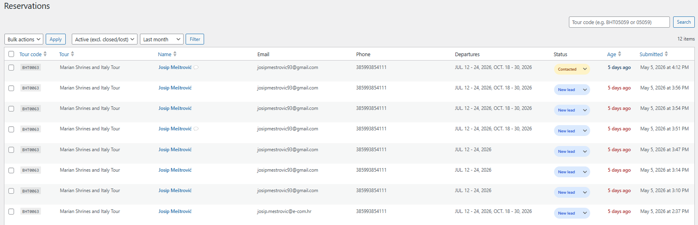
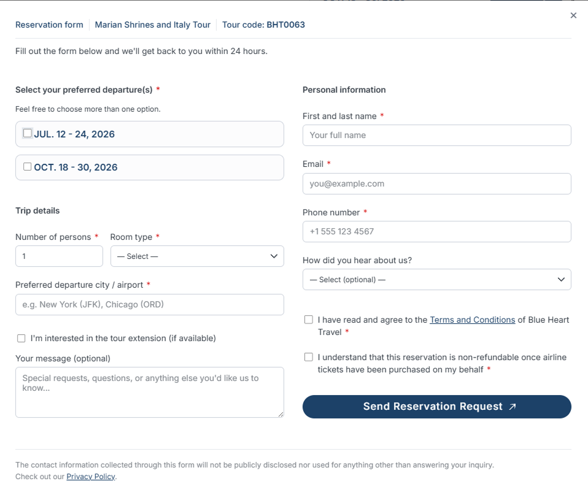

# BHT Reservation Form

**Module version: 1.2.0** — repo: [`josipmestrovic/ecom-wp-reservation-form-crm`](https://github.com/josipmestrovic/ecom-wp-reservation-form-crm)

Popup booking form for Blue Heart Travel's `catholic-tour` post type.
Self-contained Divi child-theme module — drop the folder in, require the
bootstrap from `functions.php`, and you have:

- A styled popup that opens from any element with `id="ecom-booking-btn"`
- Auto-filled tour title / code / departure list (read from ACF on the post)
- AJAX submission with WP nonce + honeypot anti-spam
- Reservation row stored in a custom DB table
- Two emails: internal admin notification + branded customer confirmation
- WP-Admin "Reservations" panel with:
  - Status workflow (New lead → Contacted → Closed / Lost) with inline pill picker
  - Auto status-change audit trail (system-tagged notes on every transition)
  - SLA-aware Age column (color-coded by status + how long it's been open)
  - Smart tour-code search (`BHT05059`, `bht05059`, or `05059` all match)
  - Combined status + date filters (default: active leads, last 3 months)
  - Per-reservation internal notes (timestamped, append-only audit trail)

---

## Screenshots

**WP-Admin → Reservations** — list view with status pills, SLA-aware Age column, tour-code search and combined status + date filters:



**Front-end popup** — opens from any `#ecom-booking-btn` trigger on a `catholic-tour` page; departures auto-filled from ACF, extension checkbox shown only when enabled:



---

## Install

### Option A — clone (recommended, lets you `git pull` updates)

From the theme root:

```powershell
cd wp-content/themes/<your-theme>
git clone https://github.com/josipmestrovic/ecom-wp-reservation-form-crm.git reservation-form
```

> The folder MUST end up named `reservation-form/` — the bootstrap path
> below depends on it.

### Option B — manual copy

Download the repo as a ZIP, extract, and drop the `reservation-form/`
folder into `wp-content/themes/<your-theme>/`.

### Activation (both options)

Add this single line to your child theme's `functions.php`:

```php
require_once get_stylesheet_directory() . '/reservation-form/reservation-form.php';
```

The DB table (`{prefix}bht_reservations`) is created automatically on `init`
via `dbDelta()`. Re-running has no effect once the schema version matches.

---

## File structure

```
reservation-form/
├── README.md                          ← you are here
├── screenshot-admin-ui.png            ← WP-Admin list view (used in this README)
├── screenshot-frontend.png            ← front-end popup (used in this README)
├── reservation-form.php               ← thin bootstrap, requires every includes/*.php
├── reservation-form.css               ← popup styles (front-end, scoped under .bht-rf-)
├── reservation-form.js                ← popup behaviour + AJAX (vanilla JS, no deps)
└── includes/
    ├── db.php                         ← schema, version tracking, table + status helpers
    ├── assets.php                     ← wp_register_style / wp_register_script
    ├── form.php                       ← renders popup markup in wp_footer
    ├── handler.php                    ← AJAX endpoint: sanitize → validate → insert → email
    ├── mailer.php                     ← admin notification + client confirmation
    ├── admin.php                      ← admin menu, list page, detail page, status + notes
    ├── admin.js                       ← inline status-pill AJAX (admin-only, ~60 lines)
    ├── admin-list-table.php           ← BHT_Reservations_List_Table (extends WP_List_Table)
    └── acf-export-2026-05-10.json     ← ACF field group + post-type export (see below)
```

---

## Request flow

```
┌──────────────────────────────────────────────────────────────────┐
│ 1. Visitor lands on a single catholic-tour page                  │
│    └─ form.php hooks into wp_footer, prints the hidden popup     │
│       and enqueues CSS/JS. wp_localize_script() exposes:         │
│         bhtReservation.ajaxurl                                   │
│         bhtReservation.nonce                                     │
│         bhtReservation.thankYou                                  │
│                                                                  │
│ 2. Visitor clicks #ecom-booking-btn                              │
│    └─ reservation-form.js opens the popup (focus trap + ESC).    │
│                                                                  │
│ 3. Visitor fills the form & submits                              │
│    └─ JS runs client-side validation, then POSTs FormData to     │
│       admin-ajax.php with action=bht_submit_reservation.         │
│                                                                  │
│ 4. handler.php (server)                                          │
│    a. check_ajax_referer() — verifies the nonce                  │
│    b. honeypot check — silently rejects bots                     │
│    c. sanitize every field with the right WP helper              │
│    d. whitelist enum values (room_type, hear_about)              │
│    e. server-side validation — JS validation is not trusted      │
│    f. derive tour_title / tour_code from $post_id (never POST)   │
│    g. $wpdb->insert() into the reservations table                │
│    h. mailer.php sends admin + client emails                     │
│    i. wp_send_json_success() — JS redirects to /thank-you/       │
│                                                                  │
│ 5. Admin reviews submissions in WP-Admin → "Reservations"        │
│    └─ admin.php + admin-list-table.php render the panel.         │
└──────────────────────────────────────────────────────────────────┘
```

---

## Admin UI — search, filters, statuses, notes

### Search box (top-right)

**Tour code only.** Three input forms all match the same row:

| You type | Matches |
| --- | --- |
| `BHT05059` | `BHT05059` |
| `bht05059` | `BHT05059` (case-insensitive) |
| `05059`    | `BHT05059` (auto re-prefixed) |

Search combines (AND) with the status and date filters.

### Status filter (top-left)

- **Active (excl. closed/lost)** — default. Hides finished leads so you only
  see what still needs work.
- **All statuses** — no filter.
- Or pick a single status: `New lead`, `Contacted`, `Closed (won)`, `Lost`.

### Date filter

- Last month / **Last 3 months (default)** / Last 6 months / Last year / All time.
- Defaults to 3 months so the list stays scannable; switch to "All time"
  whenever you need the full archive.

### Status workflow

4 statuses defined in `bht_reservation_statuses()`:

| Slug | Label | Pill color |
| --- | --- | --- |
| `new` | New lead | blue |
| `contacted` | Contacted | amber |
| `closed` | Closed (won) | green |
| `lost` | Lost | gray |

New submissions land as `new`. Change the status from:

- **List table** — click the pill, pick a new value, saved instantly via AJAX
  (uses `bht_status_nonce` + capability check + whitelist).
- **Detail page** — dropdown + "Update status" button (form POST + per-row nonce).

### Internal notes

- Live on the detail page only (the list shows a small 💬 next to the name when
  notes exist).
- Append-only and timestamped: every entry is prefixed with
  `[YYYY-MM-DD HH:MM — Author]`. There is no edit/delete UI on purpose — the
  column doubles as an audit trail.
- Stored as plain text in `admin_notes`, separated by `\n---\n`.
- **Auto status-change audit** — every status change (via the inline pill or
  the detail-page form) appends a system note like
  `[2026-05-05 14:22 — System] [system] Status changed: New lead → Contacted`.
  System notes render with a muted background + small "System" pill so they're
  visually distinct from human notes. No-op changes (same → same) are skipped.
- All append paths go through `bht_reservation_append_note( $id, $note, $is_system )`.

### Age column (SLA indicator)

The list table includes an `Age` column showing relative time-ago (`2 days ago`)
and color-coded by status to surface unworked or stale leads at a glance:

| Status | Age | Color |
| --- | --- | --- |
| `new` | ≤ 12h | muted blue (on track) |
| `new` | > 12h | amber (needs attention) |
| `new` | > 24h | red (overdue) |
| `contacted` | > 7d | amber (stale follow-up) |
| `closed` / `lost` | any | grey (terminal, no SLA) |

Thresholds are defined as class constants on `BHT_Reservations_List_Table`
(`SLA_NEW_AMBER_HOURS`, `SLA_NEW_RED_HOURS`, `SLA_CONTACTED_HOURS`) — tweak in
one place. The column is sortable; it sorts on the underlying `created_at`
timestamp (DESC = freshest first).

### "New leads" menu count bubble

The top-level **Reservations** admin menu item shows a Comments-style red
bubble with the number of reservations currently in `new` status — so unworked
leads are visible from any admin screen.

- Count is computed by `bht_reservation_new_lead_count()` and cached in the
  `bht_new_lead_count` transient for 60 seconds to avoid a query on every
  admin page load.
- The cache is invalidated by `bht_reservation_flush_lead_count()`, which is
  called whenever a reservation is inserted, deleted, or has its status
  changed (via either the AJAX pill or the detail-page form).

---

## Public PHP surface

| Function | File | Purpose |
| --- | --- | --- |
| `bht_reservation_create_table()` | `includes/db.php` | Creates / upgrades the table on `init`. |
| `bht_reservation_table()` | `includes/db.php` | Returns `{prefix}bht_reservations`. |
| `bht_reservation_statuses()` | `includes/db.php` | Status registry: `slug => [label, color, bg]`. |
| `bht_reservation_status_keys()` | `includes/db.php` | Whitelist of valid status slugs. |
| `bht_reservation_status_pill( $status )` | `includes/db.php` | Render colored status pill. |
| `bht_reservation_hear_about_label( $slug )` | `includes/db.php` | Slug → human label for the `hear_about` field. |
| `bht_reservation_enqueue_assets()` | `includes/assets.php` | Registers CSS + JS on `wp_enqueue_scripts`. |
| `bht_reservation_render_popup()` | `includes/form.php` | Prints popup markup on `wp_footer`. |
| `bht_handle_reservation_submit()` | `includes/handler.php` | AJAX endpoint (`bht_submit_reservation`). |
| `bht_send_admin_notification($data)` | `includes/mailer.php` | Internal team notification. |
| `bht_send_client_confirmation($data)` | `includes/mailer.php` | Customer "thanks, we got it" email. |
| `bht_reservation_admin_menu()` | `includes/admin.php` | Adds the WP-Admin menu (with new-leads count bubble). |
| `bht_reservation_new_lead_count()` | `includes/admin.php` | Returns the cached count of `new`-status reservations. |
| `bht_reservation_flush_lead_count()` | `includes/admin.php` | Invalidates the new-leads count transient. |
| `bht_reservation_admin_assets()` | `includes/admin.php` | Enqueues `admin.js` + nonce on the list screen only. |
| `bht_reservation_list_page()` | `includes/admin.php` | Renders the list page. |
| `bht_reservation_detail_page()` | `includes/admin.php` | Renders one reservation. |
| `bht_reservation_append_note( $id, $note, $is_system )` | `includes/admin.php` | Append a note (human or system) to the audit trail. |
| `BHT_Reservations_List_Table` | `includes/admin-list-table.php` | WP_List_Table subclass. |
| `bht_ajax_update_status()` | `includes/admin.php` | AJAX endpoint for the inline status pill. |
| `bht_post_update_status()` | `includes/admin.php` | Form POST endpoint for the detail-page status form. |
| `bht_post_add_note()` | `includes/admin.php` | Form POST endpoint for adding an internal note. |

---

## Database schema

Table: `{$wpdb->prefix}bht_reservations`
Schema version: stored in option `bht_reservation_db_version` (currently `1.2`).

| Column | Type | Notes |
| --- | --- | --- |
| `id` | BIGINT UNSIGNED PK AI | |
| `post_id` | BIGINT UNSIGNED | The catholic-tour post the reservation is for. |
| `tour_title` | VARCHAR(255) | Snapshot — survives if the post is later edited. |
| `tour_code` | VARCHAR(50) | From ACF `tour_code`, or `BHT{post_id}` fallback. |
| `selected_departures` | TEXT | **JSON-encoded** array of departure labels. |
| `full_name` | VARCHAR(255) | |
| `email` | VARCHAR(255) | |
| `phone` | VARCHAR(50) | |
| `persons` | TINYINT UNSIGNED | Min 1, validated server-side. |
| `room_type` | VARCHAR(20) | Whitelist: `single` / `double` / `triple`. |
| `departure_city` | VARCHAR(255) | Free text. |
| `extension_interest` | TINYINT(1) | Only shown when ACF `tour_extensions_boolean` is true. |
| `message` | TEXT | Optional. |
| `hear_about` | VARCHAR(50) | Whitelist (see handler.php). Optional. |
| `agree_terms` | TINYINT(1) | Required. |
| `agree_no_refund` | TINYINT(1) | Required. |
| `status` | VARCHAR(20) | Default `'new'`. Whitelist: `new` / `contacted` / `closed` / `lost`. |
| `admin_notes` | LONGTEXT | Append-only, `\n---\n`-delimited, prefixed with `[YYYY-MM-DD HH:MM — Author]`. |
| `created_at` | DATETIME | Defaults to `CURRENT_TIMESTAMP`. |

---

## ACF fields expected on `catholic-tour`

| Field | Type | Required | Purpose |
| --- | --- | --- | --- |
| `tour_code` | Text | No (auto-fallback) | Booking reference shown in popup + emails. |
| `tour_extensions_boolean` | True/False | No | If true, shows the "extension interest" checkbox. |
| `tour_departures` | Repeater | No | Each row → `departure_label` (text) + `departure_note` (text). |

If `tour_departures` has rows → checkbox list is rendered.
If empty → the form falls back to a free-text "Dates" input.

### Bundled ACF export

The full field schema this module was built against is shipped in the repo as
[`includes/acf-export-2026-05-10.json`](includes/acf-export-2026-05-10.json).
It contains:

- The **`catholic-tour`** custom post type definition (labels, `dashicons-airplane`
  icon, `catholic-tour/%category%` permalink rewrite, `category` taxonomy,
  `title` + `custom-fields` supports).
- The **Tour Details** ACF field group with every field used across the site
  (featured image, gallery, tagline, WYSIWYG description + itinerary, pricing
  note, departures repeater, extensions toggle, etc.) — a superset of the three
  fields the reservation form actually reads.

Import it on a fresh site via **WP-Admin → ACF → Tools → Import Field Groups**
(requires ACF Pro for the Repeater + Gallery field types) to recreate the exact
tour schema. The form itself only depends on `tour_code`,
`tour_extensions_boolean`, and `tour_departures` — the rest of the field group
is here for reference / parity with the production site.

---

## Security checklist

- WP nonce on every submit (`bht_reservation_nonce`).
- Honeypot (`bht_website` field) traps automated bots.
- Every input passed through `sanitize_*` / `absint`.
- Enum fields (`room_type`, `hear_about`) are strictly whitelisted.
- All `$wpdb` calls use `prepare()` or explicit `$format` arrays.
- Sort `orderby` / `order` are whitelisted before being injected into SQL.
- Admin pages gate on `current_user_can( 'manage_options' )`.
- Delete actions verify `bht_delete_reservation_{id}` or `bulk-reservations` nonces.
- `_wpnonce`, capability check, and `wp_safe_redirect` after every destructive action.
- Output in the admin detail view is escaped per-value (mix of `esc_html`, `esc_attr`, manual links).

---

## Emails

Both transactional emails (`bht_send_admin_notification()` + `bht_send_client_confirmation()` in `includes/mailer.php`) share a single branded shell: HTML + table-based layout with inline styles, plus a `<style>` block in `<head>` for mobile.

**Branding** — palette, header, footer all driven by `bht_reservation_email_shell()`:

- `header_style` — `'dark'` (white logo on `#112941`), `'light'` (color logo on `#ffffff`, used for the client email), or `'none'` (admin email — no header bar).
- `contact_footer` — when `true`, appends a 2×2 contact card with mail / web / phone icons and `mailto:` + `tel:` links (used for the client email).
- `preheader` — hidden inbox-preview text.
- Logo links to `home_url('/')`; tour titles link to `get_permalink( $post_id )`; phone numbers become `tel:` links (digits-only); emails become `mailto:` links.

Asset paths (in the child theme):

- `/inc/assets/blue-heart-travel-horizontal-logo-dark-background.png` — admin/dark header
- `/inc/assets/blue-heart-travel-horizontal-logo-white-background.jpg` — client/light header
- `/inc/assets/icons/{mail,web,phone}.jpg` — client footer contact card

**Mobile** — `<style>` block in `<head>` activates under `max-width: 600px`:

- Outer card drops to full-width, radius removed, paddings shrink (32→18px).
- Contact card cells (`.bht-contact-cell`) become `display:block; width:100%`, so the four contact lines stack vertically.
- Summary table (`.bht-sum-label` / `.bht-sum-val`) stacks label above value.
- Long emails / URLs wrap via `word-break:break-word; overflow-wrap:anywhere; table-layout:fixed`.
- iOS niceties: `x-apple-disable-message-reformatting` meta + `a[x-apple-data-detectors]` reset + `-webkit-text-size-adjust:100%`.

**Deliverability**

- `From:` is always `Blue Heart Travel <info@bluehearttravel.com>` (centralized in `bht_reservation_email_from_address()` / `_from_name()` — change in one place).
- Admin email's `Reply-To:` is set to the customer (`Full Name <email>`) so hitting Reply on the notification messages the lead directly.
- Client email's `Reply-To:` is `info@bluehearttravel.com`.
- Both messages ship as **multipart/alternative** via `bht_reservation_send_mail( $to, $subject, $html, $text, $headers )`, which hooks `phpmailer_init` once with a closure to set `$phpmailer->AltBody` and unhooks immediately after `wp_mail()`. Any installed SMTP plugin pipeline is preserved.
- Plain-text bodies mirror the HTML (title, intro, tour URL, dashed details block, signature) — better deliverability and accessibility than HTML-only.

Production deliverability still depends on SPF / DKIM / DMARC being configured for `bluehearttravel.com` on whatever SMTP service WordPress ends up routing through.

---

## Customising

- **Change the trigger button** — edit `triggerBtn` in `reservation-form.js`
  (currently `#ecom-booking-btn`).
- **Change the redirect** — edit the `thankYou` value in `wp_localize_script()`
  inside `includes/form.php`.
- **Restrict to a different post type** — change `is_singular( 'catholic-tour' )`
  in `includes/form.php`.
- **Add a new field** — four places to update:
  1. Markup in `includes/form.php`
  2. Sanitize + validate + `$data` / `$format` in `includes/handler.php`
  3. Column in `includes/db.php` schema (and bump `$db_version`)
  4. Optional: display in `includes/mailer.php` and `includes/admin.php`

---

## Versioning

Bump `BHT_RF_VERSION` in `reservation-form.php` and the `$db_version` constant
in `includes/db.php` whenever the schema changes. The next page load will run
`dbDelta()` automatically.

---

## Working with this component (git workflow)

The folder on disk **is** a clone of the GitHub repo — there's no
subtree, submodule, or Composer layer. Every command below is plain
vanilla git, run from inside `reservation-form/`.

### Pull updates from upstream

```powershell
cd wp-content/themes/<your-theme>/reservation-form
git pull
```

Hard-refresh the browser to defeat asset caching (CSS/JS use
`filemtime()` so the version string updates automatically).

### Make a change and push it

```powershell
git status
git add .
git commit -m "Fix: <short description>"
git push
```

### "I edited the same file on two sites"

Whichever clone pushes first wins. The second one will see
`rejected — non-fast-forward` on `git push`. Resolve with:

```powershell
git pull        # may produce a merge conflict — resolve in editor
git add .
git commit -m "Merge upstream"
git push
```

> **Tip:** `git pull` *before* starting any non-trivial edit saves you
> the merge dance.

### Release a new version

1. Bump the version in **three places**:
   - `BHT_RF_VERSION` constant in `reservation-form.php`.
   - `$db_version` in `includes/db.php` *(only if the schema changed)*.
   - "Module version" line at the top of this README + a Changelog entry.
2. Commit, tag, push:

```powershell
git add .
git commit -m "Release 1.3.0: <one-line summary>"
git tag v1.3.0
git push
git push --tags
```

Other sites opt into the new version with their next `git pull`. To
pin a site to a specific version (no future auto-updates):

```powershell
git checkout v1.3.0   # detached HEAD on that exact tag
```

### Semver guideline

| Change | Bump |
| --- | --- |
| Bug fix, no behavior change | patch (`1.2.0` → `1.2.1`) |
| New feature, backward compatible | minor (`1.2.0` → `1.3.0`) |
| Breaking change (DB schema rewrite, removed public function, renamed CSS class consumers depend on) | major (`1.2.0` → `2.0.0`) |

### Common pitfalls

| Symptom | Cause | Fix |
| --- | --- | --- |
| `git push` rejected (non-fast-forward) | Someone else pushed first | `git pull`, resolve any conflict, `git push` |
| Popup doesn't open after pull | The `require_once` line in `functions.php` was removed, or PHP opcache stale | Re-check `functions.php`; clear opcache / WP cache |
| Old CSS after pull | Browser cache | Hard refresh (Ctrl+Shift+R) |
| `fatal: not a git repository` | You're outside the `reservation-form/` folder | `cd` into it first |
| Nested `.git` warning when wrapping the parent theme in git | Component was cloned before parent was git-init'd | Add `reservation-form/` to the parent's `.gitignore` |

---

## Changelog

### 1.2.0 — 2026-05-10

Initial public release on GitHub. Feature set as documented above:

- Popup booking form for `catholic-tour` posts (AJAX + nonce + honeypot).
- Custom DB table `{prefix}bht_reservations` (schema v1.2).
- Branded admin + client emails (multipart, mobile-responsive).
- WP-Admin "Reservations" panel: status workflow, inline pill picker,
  SLA-aware Age column, smart tour-code search, status + date filters,
  per-reservation timestamped notes, auto status-change audit trail,
  new-leads count bubble on the menu item.

